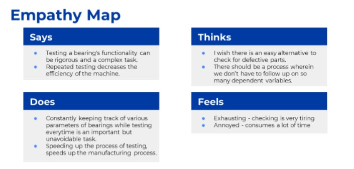
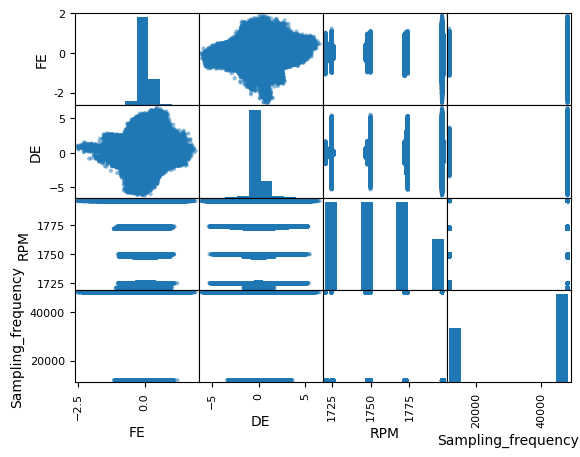

# Bearing_Classification
An innovative way of classifying the bearings using its vibration data

## Description
The project involves developing an Machine Learning algorithm that can detect the defective bearings using noise and vibration data, thus making it economical and time-saving.

## Project Development Process
### 1. Ideation and Planning
Traditional methods for detecting bearing defects typically involve extensive visual inspections or dismantling the machinery for direct examination. Visual inspections rely on human judgment, which can be error-prone, while disassembling machines is costly and disruptive.

After discussing with senior faculty, we explored **Friction-Temperature Mapping**, a less invasive technique that monitors the relationship between friction and temperature to detect early signs of wear. Though more efficient and capable of real-time monitoring, this method requires precise calibration and specialized sensors, and can sometimes produce false positives due to external temperature factors.

To evaluate these methods, we created an **Empathy Map** to understand user needs and frustrations and used a **Concept Evaluation Matrix** to compare the effectiveness, cost, and ease of implementation of each approach.

#### Empathy Map

### Concept Evaluation Matrix
![CEM][def]
[def]: images/CEM.jpg

After going through the Concept Evaluatiion Matrix, I have identified that Coming up with a Machine Leanrning Model is optimal way of approaching the problem than the traditional Methods.

### 2. Data Collection and Preprocessing
The data was collected from the Acoustics Lab at the Indian Institute of Technology, spanning various RPMs and sample frequencies. After concatenating the data into a single data frame and removing null values, a scatter matrix was plotted to examine the correlations between variables.

#### Scatter matrix

### 3. Model Development
In order to analyze the changes in the data over time, 50 data points were taken from the dataset as one datapoint. For each sample, several key statistical features were calculated: the mean, standard deviation, skewness, kurtosis, root mean square (RMS), and foam factor. These features are crucial in understanding the distribution, central tendency, and variability of the data, and provide insights into the nature of the measurements across different RPMs and sample frequencies.

Tracking how these statistical features evolve over time is important for detecting potential faults in the bearings, as each type of bearing defect is associated with distinct frequency characteristics. By analyzing these time-domain features, it is possible to identify anomalies or irregularities in the data, which may indicate the presence of specific faults, such as misalignments or wear. This approach is an example of time-domain feature extraction, a technique widely used in condition monitoring and predictive maintenance systems to detect mechanical failures before they lead to serious issues.

Then the data is split into train and test(80/20). For the model, Random Forest was chosen as the initial algorithm. Random Forest is an ensemble learning method that builds a collection of decision trees during training and combines their outputs to make predictions. After training the Random Forest model, Gradient Boosting was applied to further enhance the prediction. Gradient Boosting is another ensemble technique where each new tree corrects the errors made by the previous trees, thus improving the accuracy of the model iteratively.

### 4. Results
After training the model, we tested it with the test datset and we observed an 84% accuracy with multiclassification(detecting the type of defect) and 92% accuracy with binary classification(Defective/Not-defective)

